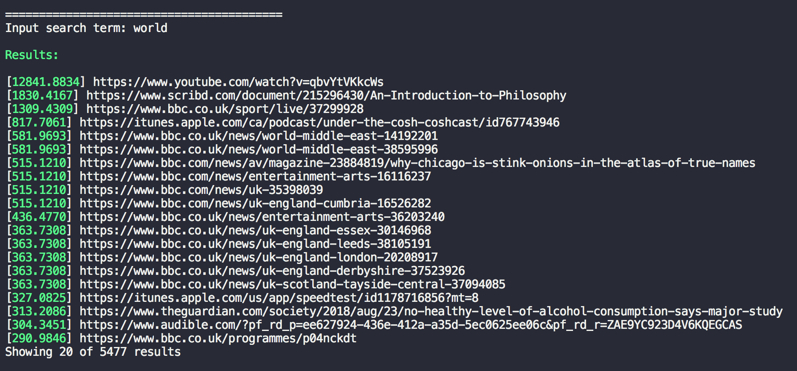

# Simple Search Engine

In this project we have created a search engine using spark and hadoop for indexing, cassandra for storage and a client in spark. It was a school project for the course Data Intensive Computing Platforms in KTH.

It parses keywords from web sites, to filter websites and uses links to create a [PageRank](https://en.wikipedia.org/wiki/PageRank). The scoring system for sorting websites is a combination of relevance (number of times keyword appears on per page) and importance (PageRank).

We recommend using web crawler data from [Common Crawl](http://commoncrawl.org). With only a very small subset the search engine performed surprisingly well, however with more computing power or / and time you could index a larger part of the internet.

## Introduction

We created a search engine using spark and hadoop for indexing, cassandra for storage and a client in spark. We used web crawler data from Common Crawl. Because of resource limitations we only used a fraction of the available files. We used 1 file out of 71520 files. Even though we only used a very small subset of the available files, the search engine performed surprisingly well, and with more computing power or / and time you could index a larger part of the internet.

The search engine parses keywords from web sites, to filter websites and uses links to create a PageRank. The scoring system for sorting websites is a combination of relevance (number of times keyword appears on per page) and importance (PageRank).

## Tools

The primary tool used was Spark, where both Spark SQL and Spark GraphX was used. Spark, together with hadoop loader, was used for processing the data and to store the processed information Cassandra was used. Finally the client was a simple Spark program to enable a final filter and computation on the dataset.

## Data

The dataset came from Common Crawl which facilitates web crawl data from over 5 billion web pages. As it consists of many terabytes of data, even in the most condensed form, we could not use all of it. We chose to use a small subset of the dataset to show a proof of concept.T he kinds of computation that is required for this task is often executed by large data centers, which is equipment we do not have access to.

Preferably the data should not be too disjointed, as a more connected set of web pages result in more accurate ranking. Two methods of requiring the data was evaluated and abandoned as they were deemed impossible. The first method would be to only collect crawler data for some domains; The top 100 or 1000 domains. This would lead to a more relevant subset. The other method discussed was to only require crawler data for one top domain, basically indexing the internet for a country.

As both methods were evaluated to be impossible we downloaded a random subset. We downloaded the first file out of 71 520 files, and indexed 120 469 web pages.

The data can be downloaded in three different formats: WARC, WAT and WET. WARC is a very comprehensive and verbose format which basically includes all the raw data from the web crawl. WAT is a format where the computed metadata from the raw WARC file is stored. WET is a format with extracted plaintext from the WARC file. WAT files was used for using links for rating web pages. WET files was used to categorize web pages after their content.

## Algorithm

There were two major steps to index websites with out method. One is categorizing web pages so that a search result show all relevant web pages with matching content. The other task is to rate the web pages so that the more relevant web pages are prioritized.

Categorizing the web pages according to content was done by analyzing the extracted plaintext from the WET files. The method used here was based on splitting all words in the plaintext for each web page and filtering out invalid characters. Most punctuation marks were removed as well as non ascii characters as they add another layer of complexity with language. From this list of URIs with keywords, a reverse index was created that contained a list of websites as well as number of occurrences for each of the keywords.

To rate web pages is a complicated task which can include algebra to weight links based on prior relevance of web page that the link originates from, combined with devaluating links from web pages with more links. It can also include natural language analysis understanding the relevance of a web page based on a specific search term. Our choice for rating was to use a combined score based of the PageRank algorithm as well as number of occurrences for the keyword. This final score was calculated by simply multiplying PageRank score with occurrences, a method that definitely could be improved.

The client for searching for keywords was implemented by connecting to the cassandra database and querying for keywords. The retrieved list was then sorted based on the previously mentioned rating mechanism. Our version was not developed to handle multiple keywords, it would however be quite simple to just append the lists and increase rating for sites with multiple hits.

## Running the Code

The data we used during testing is available from common crawl using the following two URLs.

WET (315.3 MB): <https://commoncrawl.s3.amazonaws.com/crawl-data/CC-MAIN-2018-39/segments/1537267155413.17/wet/CC-MAIN-20180918130631-20180918150631-00000.warc.wet.gz>

WAT (1.28 GB): <https://commoncrawl.s3.amazonaws.com/crawl-data/CC-MAIN-2018-39/segments/1537267155413.17/wat/CC-MAIN-20180918130631-20180918150631-00000.warc.wat.gz>

The WET-file has to be placed in the directory `“\<project-directory\>/data/WET/”`and the WAT-file has to be placed in `“\<project-directory\>/data/WAT/”`. Any number of WET or WAT files can be placed in these directories to index a larger portion of the web.

### Running the jupyter notebook files

To run the separate tasks they are located in the seperate directories “extract-keywords” and “page-rank”. Both have a jupyter notebook file that goes step by step through how we solved our problem, without the merging of the two tasks and data storage.

### Running the indexing algorithm

To run the actual code that creates the indexing of web pages and keywords in cassandra, start with running cassandra. Execute “cassandra -f” in a terminal. After that, open the directory “search-engine-indexing” and execute “sbt run” in the terminal. This will initiate the execution of the computation. This might take a while. On our computers (laptops) it took between 10 and 20 minutes.

### Running the client

To run the client open the directory “search-engine” and run “sbt run” in the terminal. This will start the client. When prompted, type a keyword to search for. If you only press enter without entering any keywords, the program will terminate.

It should look like following screenshot where the numbers to the left represents total score.

## License [![MIT license][license-img]][license-url]

> The [`MIT`][license-url] License (MIT)
>
> Copyright (c) 2018 Hannes Rabo
> Copyright (c) 2018 Julius Recep Colliander Celik
>
> Permission is hereby granted, free of charge, to any person obtaining a copy
> of this software and associated documentation files (the "Software"), to deal
> in the Software without restriction, including without limitation the rights
> to use, copy, modify, merge, publish, distribute, sublicense, and/or sell
> copies of the Software, and to permit persons to whom the Software is
> furnished to do so, subject to the following conditions:
>
> The above copyright notice and this permission notice shall be included in all
> copies or substantial portions of the Software.
>
> THE SOFTWARE IS PROVIDED "AS IS", WITHOUT WARRANTY OF ANY KIND, EXPRESS OR
> IMPLIED, INCLUDING BUT NOT LIMITED TO THE WARRANTIES OF MERCHANTABILITY,
> FITNESS FOR A PARTICULAR PURPOSE AND NONINFRINGEMENT. IN NO EVENT SHALL THE
> AUTHORS OR COPYRIGHT HOLDERS BE LIABLE FOR ANY CLAIM, DAMAGES OR OTHER
> LIABILITY, WHETHER IN AN ACTION OF CONTRACT, TORT OR OTHERWISE, ARISING FROM,
> OUT OF OR IN CONNECTION WITH THE SOFTWARE OR THE USE OR OTHER DEALINGS IN THE
> SOFTWARE.
>
> For further details see [LICENSE](LICENSE) file.

[license-img]: https://img.shields.io/badge/license-MIT-blue.svg?style=flat-square
[license-url]: https://github.com/hannesrabo/simple-search-engine/blob/master/LICENSE
